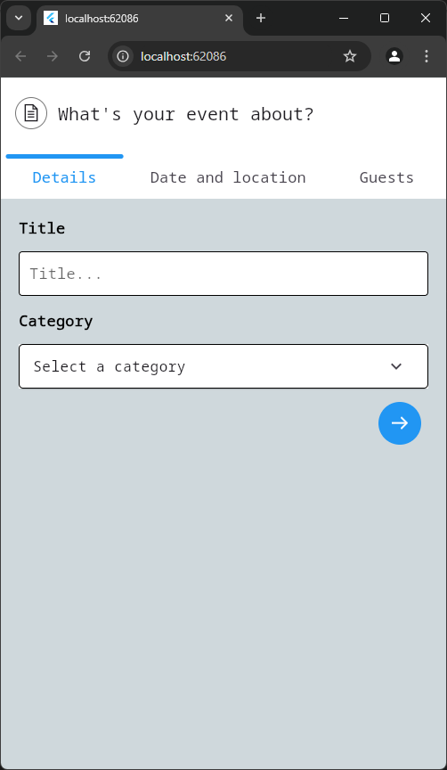
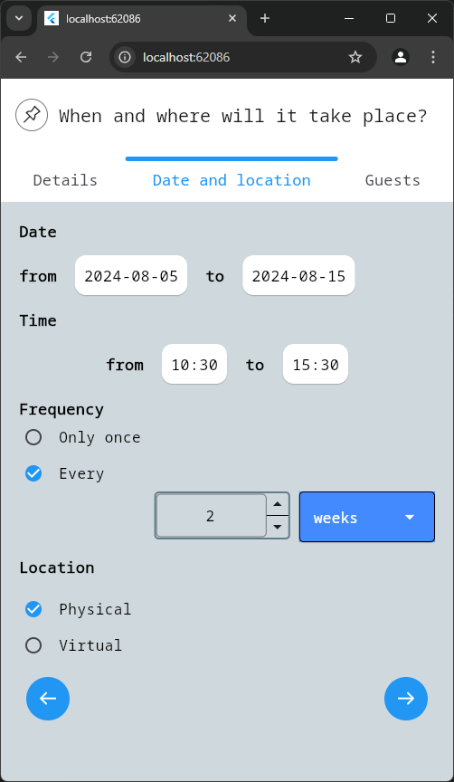
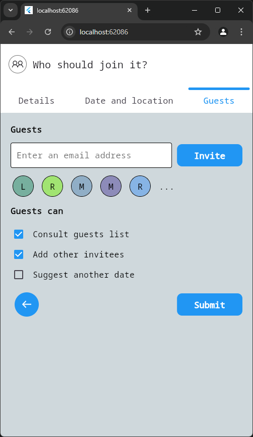
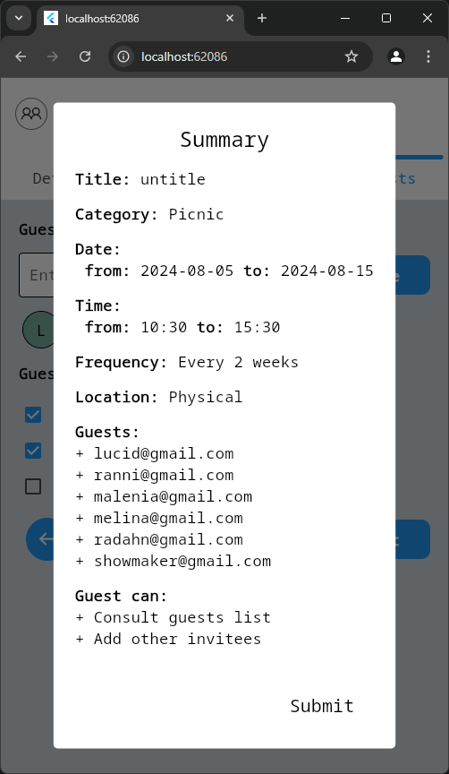

# form_validation

A flutter project to learn about form and validation

Page (1)                          | Page (2)                          |  Page(3)                          |  Summary Page                       
:--------------------------------:|:---------------------------------:|:---------------------------------:|:---------------------------------:
 |  |  |  